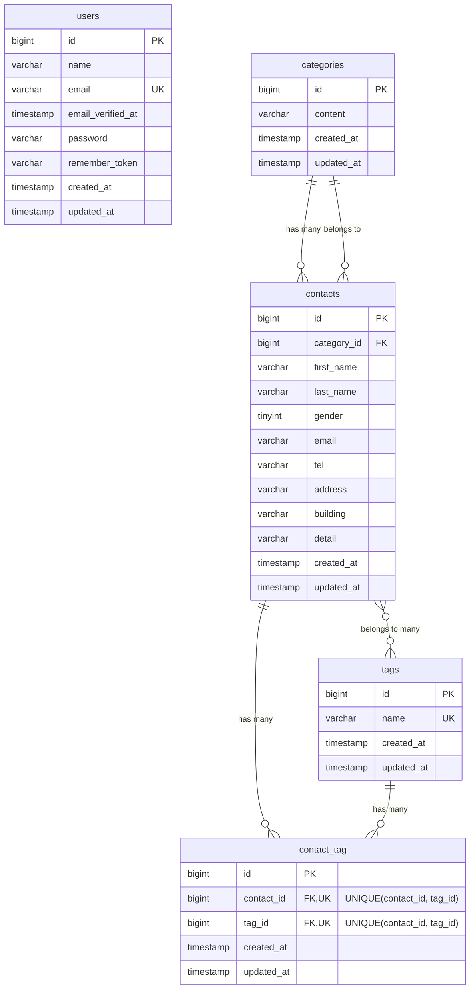

# COACHTECH お問い合わせフォーム

## アプリ概要

Laravel 10 で実装したお問い合わせフォームアプリケーションです。

プログラミングスクールの確認テスト課題として、Traditional Web 構成（Blade / Cookie セッション認証）で、お問い合わせの登録から管理までを行えるWebアプリケーションを作成しました。

一般ユーザーはお問い合わせ入力、確認画面での内容確認、送信完了後のサンクスページ表示を行えます。管理者は Fortify による登録・ログイン後、お問い合わせ一覧の閲覧、検索、詳細表示、削除、CSV エクスポート、タグ管理（追加・編集・削除）を行えます。

応用機能として、認証不要の公開 API でお問い合わせデータの一覧取得、詳細取得、作成、更新、削除にも対応しています。

## 使用技術

| 種別 | 技術 |
| --- | --- |
| 言語 | PHP 8.2（Composer platform: 8.2.32） |
| フレームワーク | Laravel Framework 10.50.2 |
| 認証 | Laravel Fortify 1.36.2 |
| DB | MySQL 8.0 |
| ORM | Eloquent ORM |
| テンプレート | Blade |
| CSS | Tailwind CSS 3.4.19 |
| フロントエンドビルド | Vite 6.4.3 / Laravel Vite Plugin 1.3.0 |
| JavaScript | Alpine.js 3.15.12 |
| 開発環境 | Docker / Laravel Sail 1.63.0 |
| DB管理 | phpMyAdmin latest |
| 整形 | Laravel Pint 1.29.3 |
| テスト | PHPUnit 10.5.64 |

## 画面一覧

| 画面 | メソッド | パス | 概要 |
| --- | --- | --- | --- |
| お問い合わせ入力画面 | GET | `/` | お問い合わせフォームを表示 |
| 確認画面 | POST | `/contacts/confirm` | 入力内容を確認表示 |
| サンクスページ | GET | `/thanks` | 送信完了メッセージと HOME リンクを表示 |
| ログイン画面 | GET | `/login` | 管理者ログイン |
| 管理者登録画面 | GET | `/register` | 管理者登録 |
| 管理画面 | GET | `/admin` | お問い合わせ一覧、検索、CSV エクスポート、タグ管理 |
| お問い合わせ詳細画面 | GET | `/admin/contacts/{contact}` | お問い合わせ詳細表示、削除 |
| タグ編集画面 | GET | `/admin/tags/{tag}/edit` | タグ名編集 |

## 主な機能

- お問い合わせ入力、バリデーション、確認、保存
- タグ付きお問い合わせ登録
- 管理者登録、ログイン、ログアウト
- 管理画面でのお問い合わせ一覧表示
- キーワード、性別、カテゴリ、日付による検索
- 7件ごとのページネーション
- お問い合わせ詳細表示
- お問い合わせ削除
- CSV エクスポート
- タグ追加、編集、削除
- 公開 API によるお問い合わせ CRUD

## デザイン

全画面で提供された見本画像に合わせ、Blade と Tailwind CSS を中心にレイアウトと配色を調整しています。

- 共通ヘッダーは中央に `FashionablyLate` ロゴを表示
- ヘッダー右上の表示は画面ごとに切り替え
  - `/`、`/contacts/confirm`、`/thanks`: 右上リンク非表示
  - `/login`: `register` のみ表示
  - `/register`: `login` のみ表示
  - `/admin` 以下: `logout` のみ表示
- お問い合わせ入力画面はラベル列と入力列の2カラムレイアウト
- 確認画面は2カラムの確認テーブルレイアウト
- サンクスページは背景に薄い `Thank you` を配置
- ログイン画面と管理者登録画面はカードレイアウトに統一
- 管理画面は検索フォーム、ページネーション、一覧テーブル、タグ管理 UI を見本画像に合わせて調整
- お問い合わせ詳細画面は2カラムテーブル形式に調整
- タグ編集画面は淡いベージュ背景のカードレイアウトに調整

## ER図



`contact_tag` は `contact_id` と `tag_id` の組み合わせに複合ユニーク制約を設定しています。

## テーブル構成

| テーブル名 | 概要 | 主なリレーション |
| --- | --- | --- |
| users | 管理画面にログインする管理ユーザー | なし |
| categories | お問い合わせ分類マスタ | `categories` 1 : N `contacts` |
| contacts | エンドユーザーのお問い合わせ情報 | N : 1 `categories`, N : N `tags` |
| tags | お問い合わせに付与するタグマスタ | N : N `contacts` |
| contact_tag | お問い合わせとタグの中間テーブル | `contacts` と `tags` の多対多を管理 |

詳細なカラム定義は [table_definition.md](table_definition.md) を参照してください。

## APIエンドポイント一覧

| メソッド | パス | 概要 |
| --- | --- | --- |
| GET | `/api/v1/contacts` | お問い合わせ一覧取得、検索、ページネーション |
| GET | `/api/v1/contacts/{contact}` | お問い合わせ詳細取得 |
| POST | `/api/v1/contacts` | お問い合わせ新規作成 |
| PUT | `/api/v1/contacts/{contact}` | お問い合わせ更新 |
| DELETE | `/api/v1/contacts/{contact}` | お問い合わせ削除 |

## 環境構築手順

Docker Desktop が起動している状態で実行してください。

### 1. リポジトリ取得

```bash
git clone <repository-url>
cd contact-form-app
```

### 2. 環境変数の設定

```bash
cp .env.example .env
```

`.env` の DB 設定は以下にしてください。

```env
DB_CONNECTION=mysql
DB_HOST=mysql
DB_PORT=3306
DB_DATABASE=laravel
DB_USERNAME=sail
DB_PASSWORD=password
```

### 3. 依存パッケージのインストール

```bash
composer install
npm install
```

### 4. Sail 起動

```bash
./vendor/bin/sail up -d
```

### 5. アプリケーションキー生成

```bash
./vendor/bin/sail artisan key:generate
```

### 6. マイグレーションと初期データ投入

```bash
./vendor/bin/sail artisan migrate --seed
```

初期管理者アカウント:

- email: `test@example.com`
- password: `password`

### 7. フロントエンド起動

```bash
./vendor/bin/sail npm run dev
```

本番ビルドを確認する場合:

```bash
./vendor/bin/sail npm run build
```

### 8. 動作確認

ブラウザで以下にアクセスします。

- アプリケーション: http://localhost
- phpMyAdmin: http://localhost:8080

管理画面は以下の初期管理者アカウントでログインできます。

- email: `test@example.com`
- password: `password`

## 開発環境URL

- アプリケーション: http://localhost
- phpMyAdmin: http://localhost:8080

## 動作確認

以下の動作を実装済みです。

- お問い合わせ入力、確認、保存
- 入力バリデーション
- サンクスページ表示
- 管理者登録
- ログイン、ログアウト
- 管理画面のお問い合わせ一覧表示
- キーワード、性別、カテゴリ、日付検索
- ページネーション
- お問い合わせ詳細表示
- お問い合わせ削除
- CSV エクスポート
- タグ追加
- タグ編集
- タグ削除
- 公開 API の一覧、詳細、作成、更新、削除
- Feature / Unit テスト

## 実行コマンド

```bash
composer install
npm install
./vendor/bin/sail up -d
./vendor/bin/sail artisan key:generate
./vendor/bin/sail artisan migrate --seed
./vendor/bin/sail npm run dev
./vendor/bin/sail npm run build
./vendor/bin/sail artisan test
./vendor/bin/pint --test
```

## テスト・整形

- `php artisan test` により正常動作を確認します。
- Laravel Pint によりコード整形を確認します。

## 作成者

Daichi Iwama
